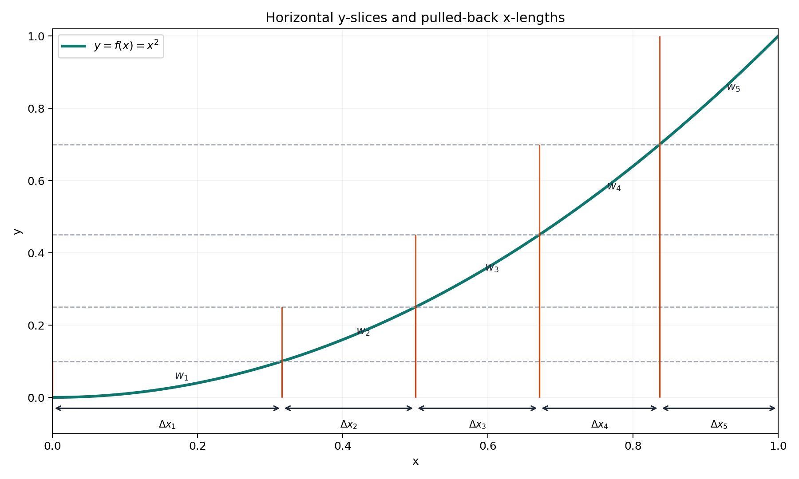
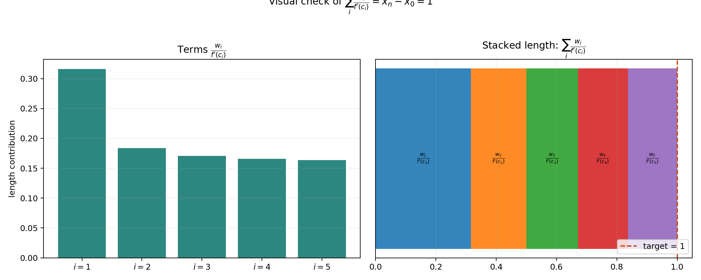

# A Weighted Mean-Value Problem

## 202611116 박우민

---

## Statement

Let $f:[0,1]\to\mathbb{R}$ satisfy:

1. $f$ is continuous on $[0,1]$.
2. $f$ is differentiable on $(0,1)$.
3. $f'(x)>0$ for every $x\in(0,1)$.
4. $f(0)=0$ and $f(1)=1$.

Let $w_1,\dots,w_n>0$ with

$$
\sum_{i=1}^n w_i=1.
$$

Show that there exist $c_1,\dots,c_n\in(0,1)$ such that

$$
\sum_{i=1}^n \frac{w_i}{f'(c_i)}=1.
$$

---

## Idea of the Proof

We convert weights into partition points of $[0,1]$,
then apply the usual Mean Value Theorem on each piece.

---

## Step 1: Build Cumulative Sums

Define

$$
y_0=0,
\qquad
y_i=\sum_{k=1}^i w_k\quad(i=1,\dots,n).
$$

Since each $w_i>0$,

$$
0=y_0<y_1<\cdots<y_n=1.
$$

---

## Step 2: Pull Back by $f$

Because $f$ is continuous on $[0,1]$ and $f(0)=0, f(1)=1$,
IVT gives, for each $i$, a point $x_i\in[0,1]$ with

$$
f(x_i)=y_i.
$$

Also, $f'(x)>0$ implies $f$ is strictly increasing,
so each $x_i$ is unique.

Hence

$$
0=x_0<x_1<\cdots<x_n=1.
$$

---

## Step 3: Apply MVT on Each Interval

Fix $i\in\{1,\dots,n\}$. On $[x_{i-1},x_i]$,
$f$ is continuous and differentiable inside,
so by MVT there exists

$$
c_i\in(x_{i-1},x_i)\subset(0,1)
$$

such that

$$
f'(c_i)=\frac{f(x_i)-f(x_{i-1})}{x_i-x_{i-1}}
=\frac{y_i-y_{i-1}}{x_i-x_{i-1}}
=\frac{w_i}{x_i-x_{i-1}}.
$$

So

$$
x_i-x_{i-1}=\frac{w_i}{f'(c_i)}.
$$

---

## Step 4: Sum Everything

Now sum over $i=1,\dots,n$:

$$
\sum_{i=1}^n \frac{w_i}{f'(c_i)}
=\sum_{i=1}^n (x_i-x_{i-1})
=x_n-x_0
=1.
$$

Therefore,

$$
\boxed{\sum_{i=1}^n \frac{w_i}{f'(c_i)}=1.}
$$

---

## Visual 1: y-slices and preimage lengths

Short note:
- We split the y-axis first by $w_i$.
- Then each y-slice is pulled back to an x-interval.
- That x-length is what appears as $\frac{w_i}{f'(c_i)}$.

---

## Visual 2: why the sum becomes 1

Short note:
- Each bar is one term $\frac{w_i}{f'(c_i)}$.
- Stacking all terms gives total length $x_n-x_0$.
- Since $x_0=0$ and $x_n=1$, the total is exactly 1.

---

## Closing remark

This is the same proof idea in picture form:
split in y, pull back to x, and add lengths.

That is why this feels close to a Lebesgue-style viewpoint.

