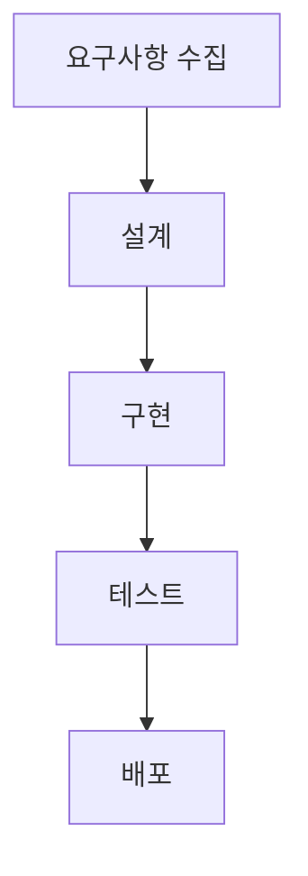
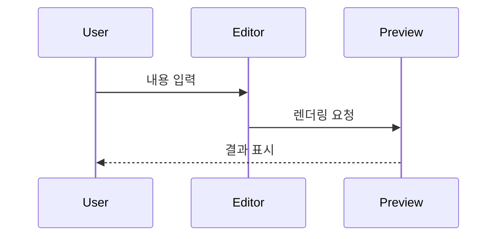

# 에디터 통합 테스트 문서

이 문서는 리포트 스튜디오의 핵심 기능을 빠르게 확인하기 위한 테스트 케이스이다.

## 0. 테스트 체크리스트

- [ ] 제목/문단/목록/강조 렌더링 확인
- [ ] 표 렌더링 확인
- [ ] 코드 블록 렌더링 확인
- [ ] 인라인 수식 렌더링 확인
- [ ] 블록 수식 렌더링 확인
- [ ] 행렬(2x2, 3x3) 렌더링 확인
- [ ] 적분/미분 수식 렌더링 확인
- [ ] Mermaid 다이어그램 렌더링 확인
- [ ] 위키링크 클릭 이동 확인
- [ ] 연결 문서/백링크 패널 반영 확인

---

## 1. Markdown 기본 렌더링

이 문단은 일반 텍스트이다.

강조 테스트: **굵은 글씨**, *기울임 글씨*, ***굵기+기울임***

### 목록 테스트

- 항목 A
- 항목 B
- 항목 C

1. 순서 1
2. 순서 2
3. 순서 3

### 체크리스트

- [x] 체크 완료
- [ ] 체크 필요

### 표 테스트

| 항목 | 값 | 비고 |
|---|---|---|
| 온도 | 25 | 실내 |
| 습도 | 40% | 양호 |
| 상태 | 정상 | 테스트 |

### 코드 블록 테스트

```javascript
function testEditor(name) {
  return `Hello, ${name}`;
}
console.log(testEditor("Report"));
```

---

## 2. 수식 테스트

### 인라인 수식

질량-에너지 등가는 $E=mc^2$ 이다.

### 블록 수식

$$
x = \frac{-b \pm \sqrt{b^2 - 4ac}}{2a}
$$

### 2x2 복소 행렬

$$
A = \begin{bmatrix}
1 + 2i & 3 - i \\
-2i & 4 + i
\end{bmatrix}
$$

### 3x3 행렬

$$
B = \begin{bmatrix}
a_{11} & a_{12} & a_{13} \\
a_{21} & a_{22} & a_{23} \\
a_{31} & a_{32} & a_{33}
\end{bmatrix}
$$

### 정적분 / 이중적분 / 미분

$$
I_1 = \int_a^b f(x)\,dx
$$

$$
I_2 = \iint_D f(x,y)\,dx\,dy
$$

$$
\frac{d}{dx}f(x) = \lim_{h\to 0}\frac{f(x+h)-f(x)}{h}
$$

$$
\frac{\partial z}{\partial x} = \frac{\partial}{\partial x}f(x,y)
$$

---

## 3. Mermaid 다이어그램 테스트





---

## 4. 옵시디언 스타일 위키링크 테스트

아래 링크들은 같은 앱 내부 리포트 제목과 일치하면 클릭 이동이 가능하다.

- [[실험 보고서 템플릿]]
- [[문헌 리뷰 템플릿]]
- [[회의록 템플릿]]
- [[존재하지 않는 문서 예시]]

백링크 테스트를 위해 다른 문서에도 현재 문서 제목인 [[에디터 통합 테스트 문서]] 링크를 넣어 확인한다.

---

## 5. 혼합 스트레스 테스트

텍스트 + 수식 + 표 + 링크를 섞어서 렌더링이 깨지지 않는지 확인한다.

- 실험식: $\mu = \frac{1}{n}\sum_{i=1}^{n}x_i$
- 행렬식:

$$
\det(A) = a_{11}a_{22} - a_{12}a_{21}
$$

- 내부 링크: [[에디터 통합 테스트 문서]]

| 지표 | 수치 |
|---|---|
| 정확도 | 0.92 |
| 손실 | 0.11 |

테스트 종료.
